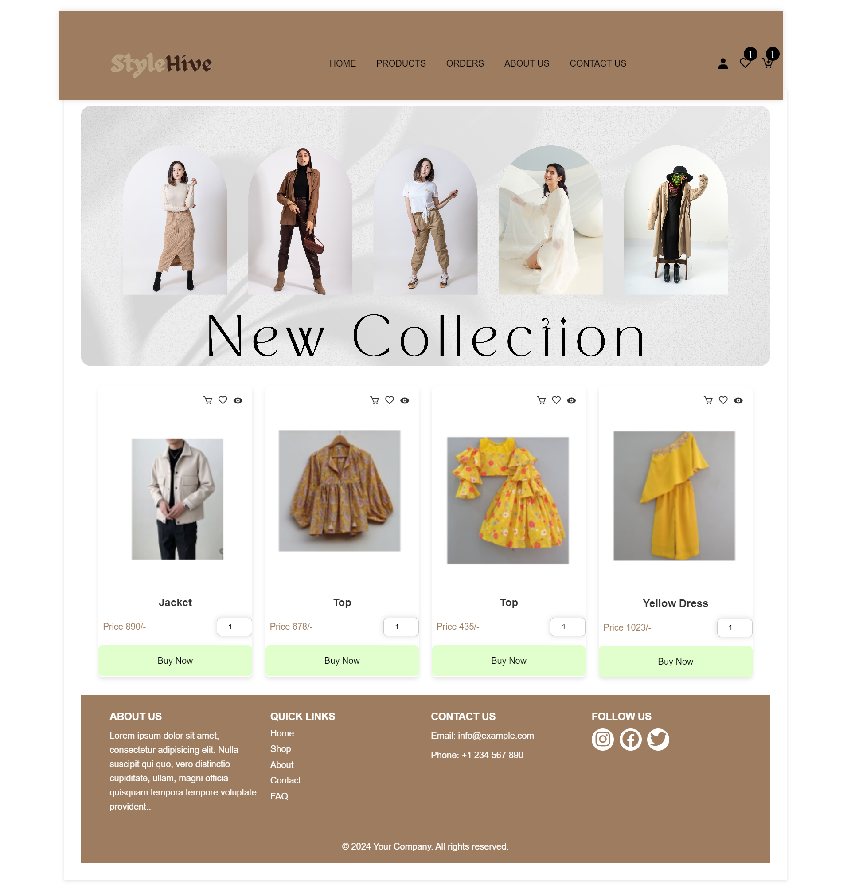

<h1> Ecommerce Website </h1>

  

Overview
This is a fully functional e-commerce website built with HTML, CSS, JavaScript, and PHP. The project supports both User and Admin roles. Users can register, log in, browse products, manage their profiles, and place orders. Admins can manage the products, users, and orders via a secure admin panel.

Table of Contents
Features
User Features
Admin Features
Technologies Used
Setup and Installation
Screenshots

User Features
User Registration and Login: Users can register for an account and log in securely.
User Profile Management: Users can update their personal details and view their profiles.
Order History: Users can view their past orders and order details.
Wishlist: Users can save products to their wishlist for future purchases.
Contact Form: Users can submit inquiries or feedback through a contact form.

Admin Features 
Admin Authentication: Secure login with role-based access control.
Multi-factor authentication for added security.
Product Management: Add new products with images, price, description, and categories.
User Management: View and manage all users.
Order Management: View and manage order statuses.

Technologies Used
HTML: Structure of the web pages.
CSS: Styling of the web pages.
JavaScript: Client-side scripting.
PHP: Server-side scripting.
PhpMyAdmin: Database management.

Installation
Clone the Repository
git clone https://github.com/Parmita22/ecommerce-website.git
cd ecommerce-website
Setup the Database
Import the database.sql file into PhpMyAdmin to create the necessary tables and data.
Configure the Database Connection
Update the database connection details in the db.php file.
Start the Server
Use a local server environment like XAMPP, WAMP, or MAMP to run the project.

## Screenshots
1. **HomeScreen**

  

2. **Aboutus**
  

  

3. **ProductPage**
  

  

 
4. **OrderPage**
  

  

